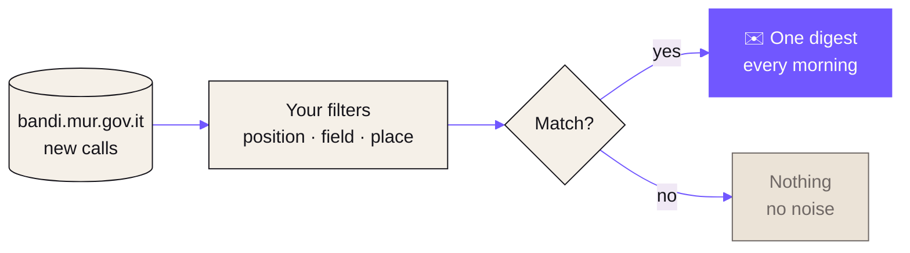

<a href="https://postthedoc.it">
  <picture>
    <source media="(prefers-color-scheme: dark)" srcset=".github/assets/banner-dark.svg">
    
  </picture>
</a>

  <strong>Email notifications about new academic job calls in Italian universities and research institutes.</strong> 
  Tell it once what you are looking for. Every morning it reads the new calls and writes to you only when there is one for you.

  
  
  
  

<h3>
  <a href="https://postthedoc.it">Subscribe</a>
  &nbsp;·&nbsp;
  <a href="https://postthedoc.it/en/philosophy/">Why this exists</a>
  &nbsp;·&nbsp;
  <a href="#-support-the-project">Support</a>
  &nbsp;·&nbsp;
  <a href="https://github.com/Herbrant/PostTheDoc/issues">Report an issue</a>
</h3>

 

## ✦ Why PostTheDoc exists

Anyone looking for an academic position in Italy knows the routine well: every day, open the
calls portal, the websites of single universities, department pages, mailing lists, group chats
with colleagues. Check, filter, note down the deadlines. And hope you did not miss anything.

**PostTheDoc exists to take that burden off researchers.**

### The problem

Calls exist and they are public. But there are many of them, they are scattered and they are
short-lived.

<table>
  <tr>
    <td width="33%" valign="top">
      <h3>Many</h3>
      Hundreds of institutions (universities, research institutes, fine arts and music academies)
      publish calls every week: PhDs, research fellowships and contracts, researcher,
      technologist and professor positions.
    </td>
    <td width="33%" valign="top">
      <h3>Scattered</h3>
      Each kind of position has its own section, each institution its own website, and there is
      no simple way to be notified only about what concerns you.
    </td>
    <td width="33%" valign="top">
      <h3>Short-lived</h3>
      Often only a few weeks pass between publication and deadline. Noticing late means not having
      time to prepare the application.
    </td>
  </tr>
</table>

So finding the right call too often depends on luck, word of mouth or the network of people
around you. Those with an attentive group or a well-informed supervisor start ahead; those moving
to a new city, field or country fall behind. *It should not work this way.*

### The idea

> **Flip it around: instead of you looking for calls every day, the calls come to you.**

You say once what you are looking for (position, field, location) and from then on, every
morning, PostTheDoc reads the new calls published on [bandi.mur.gov.it](https://bandi.mur.gov.it)
and writes to you only if there is one for you.

**Why email?** No app to install, no account to create, no feed to remember to open. Email is the
tool that everyone working in academia checks every day anyway. One digest, only when needed: if
nothing comes up for you, you get nothing.

### Principles

| | |
|---|---|
| 💜 **Free, forever** | Nobody should have to pay to learn that a public call exists. |
| 🔒 **The bare minimum of data** | Only your email and your preferences. Anonymous, cookieless visit statistics, no profiling. When you unsubscribe, your data is really deleted. |
| 🔑 **No password** | Every email carries signed links to change your preferences or unsubscribe in one click. |
| 🧩 **Open source** | Anyone can check what it does, report a problem or improve it. |
| 🌍 **Bilingual** | Pages and emails in Italian and English, because Italian academia is also made of people coming from abroad. |

 

## ✦ How it works

Four steps, *zero* hassle. The first two take less than a minute; PostTheDoc takes care of the
rest, every morning.

| | |
|:---:|---|
| **01** | **Tell it what you are looking for.** Pick the positions you care about, your scientific fields and the regions or universities where you would like to work. |
| **02** | **Confirm your email.** You get a link: one click and you are in. No password to remember. |
| **03** | **Every morning it reads the calls.** It checks the new calls published on bandi.mur.gov.it, the Ministry portal that collects those of Italian universities and research institutes. |
| **04** | **You get only the relevant ones.** One digest email, only on the days when there is something for you: institution, field, deadline and a link to the official call. |

### You choose what you get

Every filter is optional except the position: with no filters you get everything.

- **Positions** — 9 kinds: PhD, research fellowship, postdoc fellowship, research contract,
  research grant, researcher (RTD/RTT), technologist, associate and full professor.
- **Fields** — 190 scientific-disciplinary groups (G.S.D.) from Italian DM 639/2024, e.g.
  `INFO-01` Computer science. Or all of them.
- **Location** — all of Italy, some of the 20 regions, or single institutions among ~300
  universities, online universities, research institutes and fine arts and music academies.
- **Language** — Italian or English, for the web pages and every email.

> [!NOTE]
> PostTheDoc is **not an official service** of the Italian Ministry of University and Research
> and does not replace reading the call. The information comes from the Ministry portal and may
> be incomplete: the call published by the institution is always the reference.

 

## ✦ Support the project

PostTheDoc is an independent project, born to make looking for a place in academia a little less
exhausting. It is and will stay **free for everyone**.

Keeping it running has some costs: the domain, email delivery and development time. If PostTheDoc
has been useful to you and you want to chip in, you can do so here. It is entirely optional:
nothing changes if you do not donate.

  
  &nbsp;
  

## ✦ Contributing

Found a mistake or a missing call, or have an idea to improve it?
[Open an issue](https://github.com/Herbrant/PostTheDoc/issues): every report helps. Pull requests
are welcome too: [CONTRIBUTING.md](CONTRIBUTING.md) describes how to contribute and
[docs/DEVELOPMENT.md](docs/DEVELOPMENT.md) explains how to run everything locally.

 

## ✦ Deploy your own instance

PostTheDoc needs no server: everything fits in the free tiers of **GitHub Actions** (daily job
and frontend on GitHub Pages), **Cloudflare** (Worker API, D1 database, Turnstile) and **Brevo**
(email delivery).

1. **Cloudflare** — create the D1 database in the EU jurisdiction, a Turnstile widget and an API
   token; set the Worker secrets (`TOKEN_SECRET`, `BREVO_API_KEY`, `TURNSTILE_SECRET`).
2. **Brevo** — create an account, verify the sender domain (SPF/DKIM) and create an API key.
3. **GitHub** — add the Actions secrets and variables (Cloudflare credentials, sender, site and
   API URLs, data controller for the privacy notice) and set Pages to deploy from GitHub Actions.
4. **Push to `main`** — the Worker and the frontend are deployed automatically.
5. **Run `daily.yml` once** — the first run records the calls already open without sending
   emails; from the next day on, only new calls are sent.

The full list of secrets and variables, the architecture, local development, GDPR notes for the
operator and free-tier limits are in **[docs/DEVELOPMENT.md](docs/DEVELOPMENT.md)**.

## ✦ License

Copyright © 2026 Davide Carnemolla.

PostTheDoc is free software: you can redistribute it and/or modify it under the terms of the
[GNU General Public License](LICENSE) as published by the Free Software Foundation, either
version 3 of the License, or (at your option) any later version. It is distributed in the hope
that it will be useful, but without any warranty.

 

---

  <picture>
    <source media="(prefers-color-scheme: dark)" srcset=".github/assets/mark-dark.svg">
    
  </picture>
  

    <strong>PostTheDoc</strong> · <em>The right call, without searching for it every day.</em> 
    
      Calls collected from <a href="https://bandi.mur.gov.it">bandi.mur.gov.it</a> ·
      Visual style adapted from <a href="https://github.com/Dharani-Eswaramurthi/latentfolio">LatentFolio</a> (MIT)
    
  

